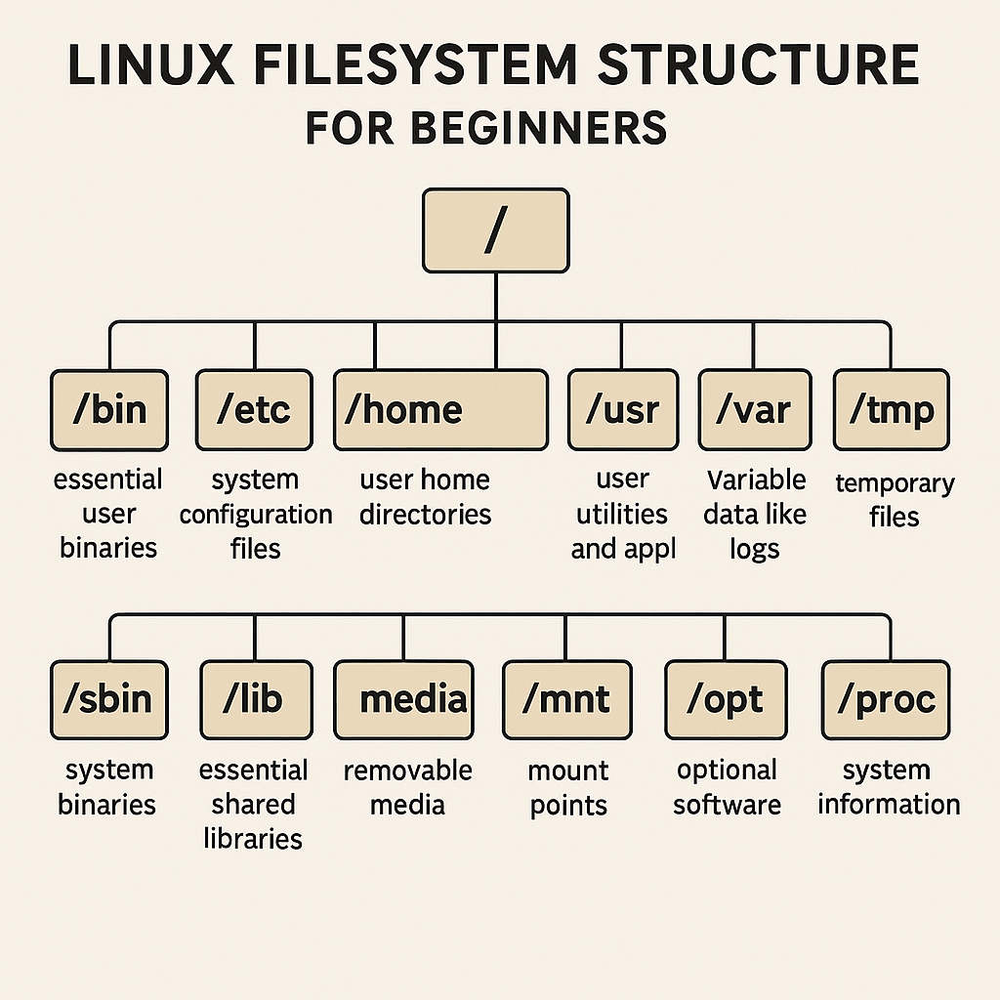
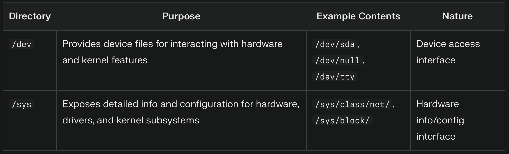

# Getting Started with Linux: Major Linux Distributions and our first Linux VM (Virtual Machine)

### [YouTubeVideo](TBD)
## Major Linux "Distributions"  

### Red Hat  
- **Founded**: March 1993  
- **Package Manager**: RPM-based  
- **More Info**: [Red Hat Wikipedia](https://en.wikipedia.org/wiki/Red_Hat)  
- **Interesting Fact**: The name "Red Hat" originates from founder Marc Ewing's college experience. While at Carnegie Mellon University, Ewing wore his grandfather’s red Cornell lacrosse cap. His peers would say, "If you need help, look for the guy in the red hat."  

---

### Debian  
- **Founded**: August 1993  
- **Package Manager**: APT (high-level), dpkg (low-level)  
- **More Info**: [Debian Wikipedia](https://en.wikipedia.org/wiki/Debian)  
- **Interesting Fact**: The name "Debian" is a combination of the names of its creator, Ian Murdock, and his wife, Debra (Deb + Ian).  

---

### SUSE  
- **Founded**: March 1994  
- **Package Manager**: ZYpp (standard), YaST (GUI or curses front-end), zypper (command-line front-end), RPM (low-level)  
- **More Info**: [SUSE Wikipedia](https://en.wikipedia.org/wiki/OpenSUSE)  
- **Interesting Fact**: SUSE's name is derived from the German acronym "S.u.S.E." meaning "Software und System-Entwicklung" (Software and Systems Development). It also subtly references Konrad Zuse, a pioneer of modern computing.  

---

### Slackware  
- **Founded**: July 1993  
- **Package Manager**: pkgtool, slackpkg  
- **More Info**: [Slackware Wikipedia](https://en.wikipedia.org/wiki/Slackware)  
- **Interesting Fact**: Slackware's name is a humorous nod to the "pursuit of Slack," a concept from the parody religion Church of the SubGenius. 

---

### KNOPPIX  
- **Founded**: 2000  
- **Package Manager**: APT (Debian-based)  
- **More Info**: [KNOPPIX Wikipedia](https://en.wikipedia.org/wiki/Knoppix)  
- **Interesting Fact**: KNOPPIX is a bootable Live system that does not require installation on a hard disk. It uses on-the-fly decompression to fit up to 2 GB of software on a CD or over 9 GB on a DVD "Maxi" edition.  
- **Use Cases**: Desktop productivity, educational purposes, rescue system, and commercial software demos.  
---

## Linux Filesystem Structure for Beginners  

Below is a brief overview of the Linux filesystem structure:  

- **/**: Root directory, the top-level directory.  
- **/bin**: Essential user binaries.  
- **/etc**: System configuration files.  
- **/home**: User home directories.  
- **/usr**: User utilities and applications.  
- **/var**: Variable data like logs.  
- **/tmp**: Temporary files.  
- **/dev**: Device files.  
- **/sbin**: System binaries.  
- **/lib**: Essential shared libraries.  
- **/media**: Removable media.  
- **/mnt**: Mount points.  
- **/opt**: Optional software.  
- **/root**: Root user home directory.  
- **/proc**: System information.  

### Special Filesystems  
- **/dev**: Contains device files.  
- **/sys**: Provides information about the system and hardware.  

---

## Easily Install Your First Linux VM  

### Using Multipass  
Multipass is a lightweight VM manager that makes it easy to create and manage Linux virtual machines.  

- **Installation Guide**: [Multipass Installation](https://canonical.com/multipass/install)  

---  
